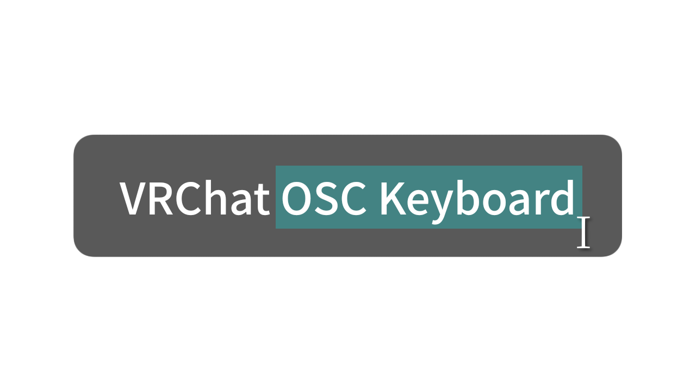

# VRC-OSC-Keyboard
VRChatのチャットボックスにソフトウェアキーボードや物理キーボードを使用して<br>
OSC経由でメッセージを送信するツール



<div align="center">

  [](https://antigravity.google)
  [](https://x.com/fuku_2019_vrc)
  
  
  [](https://windows.com)
  


  

[**日本語**](/README.md) | [English](/docs/en/README.en.md)

</div>

## 機能
+ 内蔵ソフトウェアキーボードによりVRから簡単に日本語チャットが可能
+ 物理キーボードからソフトのテキストボックスに入力することで漢字変換も使用可

## 注意事項
一般VRChatterがAntigravityを使用して適当に作った実験的なツールです。
<br>
このソフトを使用したことで発生したトラブルについては自己責任でお願いします。

https://github.com/user-attachments/assets/988b4c58-d770-46fa-ad06-91ad71321da8

## 手動ビルド
```bash
# ライブラリのインストール
npm install
# ビルドの実行
npm run dist
```
